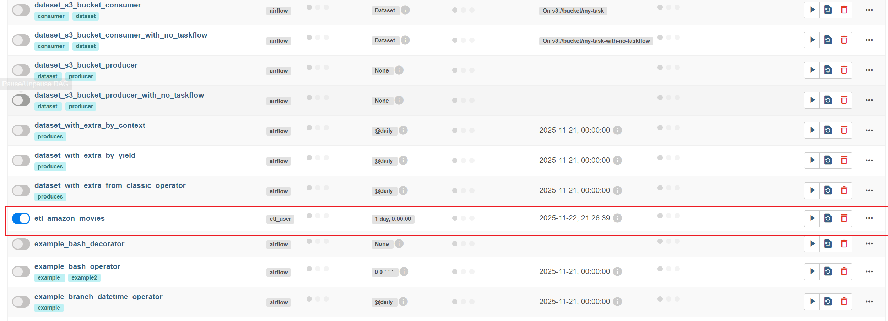
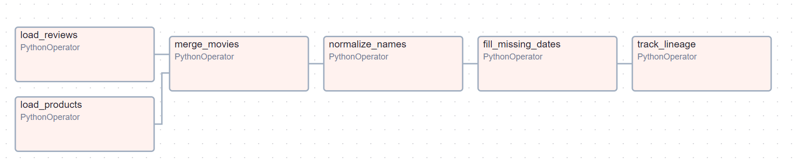
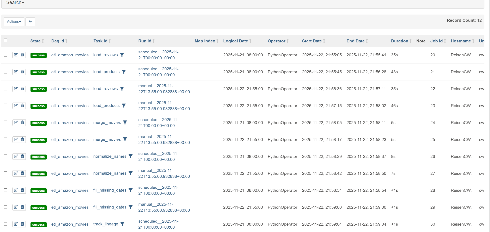

# ETL(Extract Transform Load) 作业要求
- **数据来源**：http://snap.stanford.edu/data/web-Movies.html 
- **ETL要求**：
  1. 获取用户评价数据中的7,911,684个用户评价
  2. 从Amazon网站中利用网页中所说的方法利用爬虫获取253,059个Product信息页面
  3. 挑选其中的电影页面，通过ETL从数据中获取
     - 电影ID，评论用户ID
     - 评论者昵称ProfileName，评论的评价Helpfulness，评分Score，评论时间Time，评论Summary(Title)，评论Text
     - 电影上映时间，电影风格，电影导演，电影演员，电影版本
  4. 在网页中不同网页可能是相同的电影（如同一部电影的蓝光、DVD版本，同一部电影的不同语言的版本等），通过ETL对相同的电影（需要给出你所认为的相同的定义）进行合并
  5. 在网页中电影演员、电影导演、电影主演等会出现同一个人但有不同名字的情况（如middle name，名字缩写等），通过ETL对相同的人名进行合并
  6. 在网页中部分电影没有上映时间，可以通过第三方数据源（如IMDB、豆瓣等）或者从评论时间来获取
  7. 通过ETL工具存储Amazon页面和最终合并后的电影之间的数据血缘关系，即可以知道某个电影的某个信息是从哪些网站或者数据源获取的，在合并的过程中最终我们采用的信息是从哪里来的。
- **可以参考的工具**：
  1. **ETL工具**：见《ETL工具使用介绍》
  2. **Web爬虫**：https://scrapy.org

# ETL工具使用介绍
## Pentaho DI工具介绍：
1. 官方tutorial：https://www.hitachivantara.com/en-us/products/pentaho-platform/data-integration-analytics/pentaho-tutorials.html（链接到外部网站）。
2. 中文网站：http://www.kettle.org.cn/（链接到外部网站）。
3. YouTube视频：
   - https://www.youtube.com/watch?v=lD2zumIyt9Q&t=14s（链接到外部网站）。
   - https://www.youtube.com/watch?v=-heDV0ZwR3w&list=PLT8E937iDWrwOj8dGMptTazyfqEjZTUt6（链接到外部网站）。


## Airflow工具介绍：
1. 官方文档：https://airflow.apache.org/docs/apache-airflow/stable/index.html（链接到外部网站）。
2. YouTube视频：https://www.youtube.com/watch?v=eZfD6x9FJ4E

# 项目介绍
项目分为几个模块：scrapy爬虫模块，airflow的调度模块

## scrapy爬虫模块
### 使用流程
- 获取网页
```shell
# 从movies.txt中获取电影ID列表(需要自行下载movies并解压到该目录)
# 结果会保存为products_id.txt, 已经包含在data目录下
cd data
python get_id.py

# 通过scrapy进行爬虫
# 结果会保存到data/crawled_html目录下, 由于爬取过程很慢, 数据已经包含并上传
cd amazon_movie_crawler
scrapy crawl amazon_movies
```

## airflow调度模块
### 使用流程
- 验证环境：若正确显示版本, 说明已成功安装airflow
```shell
aiflow version
```

- 初始化airflow数据库, 默认使用sqlite
- 默认目录在/home/username/airflow, 也可以通过设置环境变量`AIRFLOW_HOME`来更改默认目录
```shell
aiflow db init
```

- 启动airflow的web服务于http://localhost:8080 
```shell
airflow webserver -p 8080 -D
```

- 打开网页后需要登录, 如果没有账号需要注册:
```shell
airflow users create \
--username admin \
--firstname FIRST_NAME \
--lastname LAST_NAME \
--role Admin \
--email admin@example.org
```
- 输入上述指令后输入两次密码即可完成账号创建


- 运行调度器
```shell
airflow scheduler -D
```

- 为了方便, 我编写了一个shell脚本`af.sh`来简化上述操作, 具体使用方法请参考脚本内的注释说明.

### 配置说明
- 更改调度器配置请编辑`airflow/airflow.cfg`文件中[core]下方的`executor`字段, 例如将其设置为`LocalExecutor`以支持并行任务执行(默认使用SequentialExecutor, 顺序执行, 不支持并行)。更改后需要重新启动airflow, 同时需要重新创建账号密码等信息.(注意: 若更改为LocalExecutor, 需要将`sql_alchemy_conn`字段更改为支持多线程的数据库, 例如PostgreSQL等, 否则会报错)

- 找到`airflow.cfg`中的`dags_folder`, 替换为项目中./airflow/dags的绝对路径

- 其他配置请参考官方文档：https://airflow.apache.org/docs/apache-airflow/stable/configurations-ref.html

### 运行

- 从DAG列表中选择`etl_amazon_movies`，并运行


- DAG调度图


- 可以查看每个任务的具体执行情况

